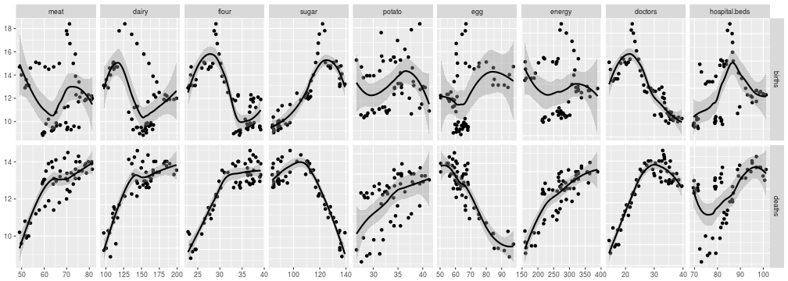

Health Modelling HUN
========================================================
author: Gabor Simon <gabor.simon75@gmail.com>
date: 2017-12-31
autosize: true

<style>
.small-code pre code {
  font-size: 1em;
}
</style>

Health of the Population
========================================================

The two most basic measures of population health are
**birth** and **death rate**.

Is there a correlation between them and our diet?

Or perhaps our healthcare infrastructure has more effect?

Pick an outcome and check your hypotheses with this interactive app:
<https://gsimon75.shinyapps.io/HealthModellingHUN/>

Choose your Predictors
========================================================

*Diet*
- meat
- dairy products
- flour/rice
- sugar
- potato
- eggs
- or the food energy content

***

*Healthcare*
- number of doctors
- number of hospital beds

Starting Ideas
========================================================
class: small-code

To begin with, the correlations between all measures:


```r
ggduo(hstat, columnsY=c("births", "deaths"), columnsX=c("meat", "dairy", "flour", "sugar", "potato", "egg", "energy", "doctors", "hospital.beds"))
```



Links
========================================================

App: <https://gsimon75.shinyapps.io/HealthModellingHUN/>

Manual: <https://gsimon75.github.io/HealthModellingHUN/>

Project home: <https://github.com/gsimon75/HealthModellingHUN>

Source of data: <http://www.ksh.hu/>
